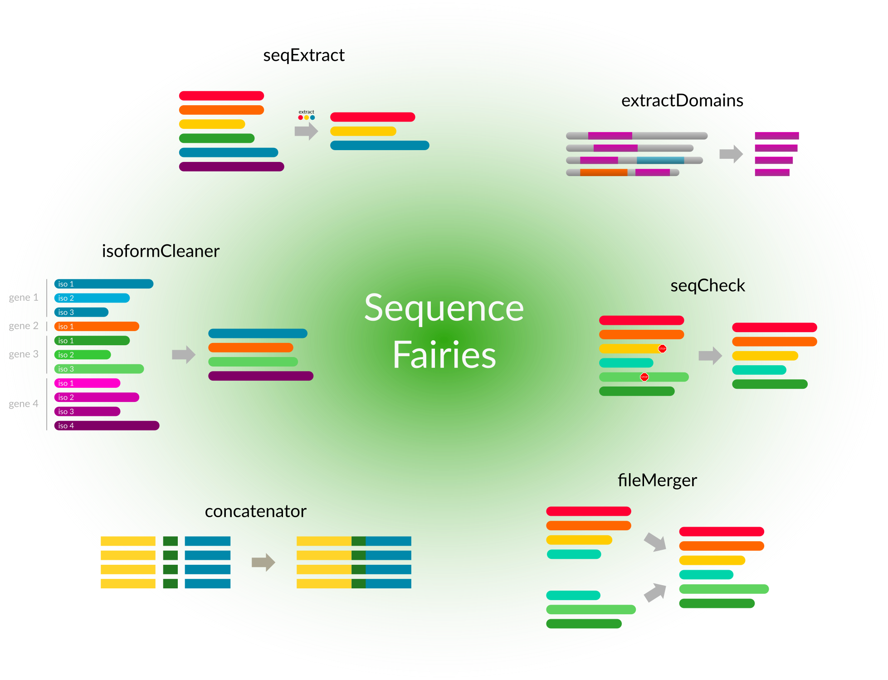

.. _general:

************
Overview
************

DW-Helper (v1.1.0) is a small program suite containaing different applications to help you with domain and sequence data.

===============
Programs
===============

Currently the following programs are included:

* :ref:`concatenator` - A program to concatenate alignments
* :ref:`extractDomains` - Can extract the domain sequences from proteins sequences
* :ref:`seqCheck` - Cleans your data set. For example it can remove stop codons from protein sequences
* :ref:`isoformCleaner <isoformCleaner>` - Removes isoforms from a sequence set and keeps only the longest one.
* :ref:`seqExtract` -   Program to extract sequences and sequence segments

===============
Contact
===============

If you have any problems, questions or suggestions concerning this programs please contact us: domainWorld@uni-muenster.de

